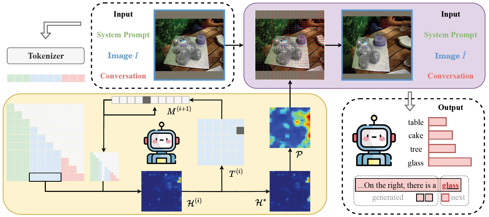

# Through the Magnifying Glass: Adaptive Perception Magnification for Hallucination-Free VLM Decoding
 
This is the official implementation of the paper:  
**["Through the Magnifying Glass: Adaptive Perception Magnification for Hallucination-Free VLM Decoding"](https://arxiv.org/abs/2503.10183)**


## 💡 Overview
We introduce **Perception Magnifier (PM)**, an inference-time decoding method for vision-language models. PM constructs and refines perception maps from attention, then **magnifies critical visual regions while compressing less relevant areas**, guiding the model to focus on fine-grained details without losing global context. This adaptive magnification strengthens visual grounding during decoding, effectively reducing hallucinations while preserving reasoning ability.
<p align="center">
  
</p>


## 🕹️ Usage
### Environment Setup
```bash
conda create --name pm python=3.10
conda activate pm
pip install -r requirements.txt
```

### Run
The main implementation of **Perception Magnifier (PM)** is located in:

```bash
experiments/eval/model_generate.py
```

This file contains the core functions for generating model outputs with PM.

### Evaluation Scripts
To reproduce results, we provide ready-to-use scripts under the `scripts/` folder:

For example, to run PM with LLaVA on MME:

```bash
bash experiments/scripts/mme/run_llava_pm.sh
```

Run PM with LLaVA on POPE:
```bash
bash experiments/scripts/pope/run_llava_pm.sh
```


## 📑 Citation
If you find our work useful, please consider citing:
```bibtex
@article{mao2025through,
  title={Through the magnifying glass: Adaptive perception magnification for hallucination-free vlm decoding},
  author={Mao, Shunqi and Zhang, Chaoyi and Cai, Weidong},
  journal={arXiv preprint arXiv:2503.10183},
  year={2025}
}
```

## 🌟 Acknowledgment
This repository extends existing implementations, with some functions and evaluation scripts adapted from **[VDD](https://github.com/yfzhang114/LLaVA-Align)**, **[API](https://github.com/yu-rp/apiprompting)**, **[PAI](https://github.com/LALBJ/PAI)**, **[Transformer-Explainability](https://github.com/hila-chefer/Transformer-Explainability)**, and **[OPERA](https://github.com/shikiw/OPERA)**.
